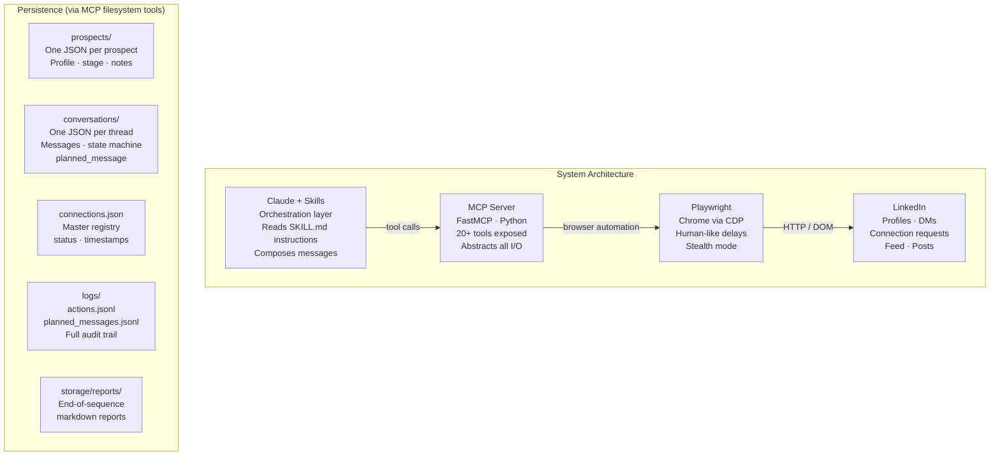
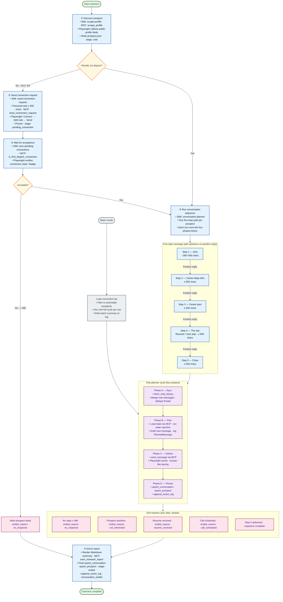

# LinkedIn Outreach

Automation and workflow tooling for LinkedIn outreach: a Python project with a **LinkedIn MCP server** (`tools/server.py`) that Claude can call for browser actions and filesystem-backed pipeline state under `outreach/`.

## Architecture


## Prerequisites

- **Python** 3.10 or newer  
- **[uv](https://docs.astral.sh/uv/)** (recommended) for environments and `uv run`  
- **Google Chrome** (live mode): used with remote debugging so Playwright can attach  
- **Claude** desktop app with **Cowork** (or another MCP host that supports stdio MCP servers)
- **Make** (for `make install`, `make browser`, etc.)

### macOS: Install Make

Apple ships **GNU Make** with the Xcode Command Line Tools. If `make --version` fails in Terminal:

1. Run:

   ```bash
   xcode-select --install
   ```

2. Complete the installer dialog, then confirm:

   ```bash
   make --version
   ```

You can still use **`uv`** commands everywhere if you prefer not to install the Command Line Tools; `make` is only a convenience wrapper around those commands.

## Install the project

From the repository root (this should create uv venv and install chromium):

```bash
make install
```

## Claude Cowork

Cowork is the task-oriented workspace in the Claude desktop app. It can use **MCP tools** (including this repo’s LinkedIn server) the same way other Claude surfaces do, as long as the server is registered in your app config.

Optional **preferences** (example in [`claude_desktop_config.json`](claude_desktop_config.json)):

- `coworkScheduledTasksEnabled` — scheduled tasks in Cowork  
- `coworkWebSearchEnabled` — web search in Cowork  
- `sidebarMode` — e.g. `"task"` for task-focused sidebar  
- `ccdScheduledTasksEnabled` — scheduled tasks for Claude Code Desktop integration, if you use it  

Merge any keys you want into your **user** Claude config (see below). Do not commit secrets or machine-specific paths.

## Installing skills

Workflow instructions for Claude live in **`outreach/skills/`**. Each skill is its **own directory** with a **`SKILL.md`** file. Those skills assume the **LinkedIn MCP server** is available (see [MCP setup](#mcp-setup)).

**Core skills (this repo):** `conversation-planner`, `send-connection-request`, `sync-pending-connections` — each under `outreach/skills/<name>/`.

### Claude
1. `Customize` → `Skills` → `+` → `Create skill` → `Upload a skill`
2. Select the `SKILL.md` files under `outreach/skills/`
3. Repeat for `conversation-planner`, `send-connection-request`, and `sync-pending-connections`

## MCP setup

### Claude
1. `Settings` → `Developer` → `Edit Config`
   - That opens `claude_desktop_config.json`.
   - On macOS the file usually lives at: `~/Library/Application Support/Claude/claude_desktop_config.json`
2. Register the LinkedIn MCP server
   - Replace the placeholders with your `uv` binary path (`which uv`).
   - Replace the placeholders with your `repo` path (`pwd`)
```json
{
  "mcpServers": {
    "linkedin": {
      "command": "/absolute/path/to/uv",
      "args": [
        "run",
        "--project",
        "/absolute/path/to/LinkedIn-Outreach",
        "/absolute/path/to/LinkedIn-Outreach/tools/server.py"
      ]
    }
  }
}
```

If you already have other MCP servers, merge the `"linkedin"` block into the existing `mcpServers` object instead of replacing the whole file.

The sample in [`claude_desktop_config.json`](claude_desktop_config.json) matches this shape; update every path to match your machine.

## Last Steps:
1. Start Chrome with debugging (from the repo root):

   ```bash
   make browser
   ```

2. Sign in to LinkedIn in that Chrome window.

3. Use Cowork / Claude with the MCP tools as usual.

If Chrome is not running with remote debugging, live tools will fail until `make browser` (or an equivalent launch) is used.

### Example Usage
1. Connect to <linkedin-url>.
2. Is <linkedin-url> my connection?
3. Add `Run conversation planner skill` as a scheduled task.

### Mock mode (optional, no browser)

For scripted tests without a browser, `tools/server.py` can run in mock mode when `_mock_mcp_enabled()` returns `True` (see the top of that file). In mock mode, tools use `tools/mock.py` instead of Playwright.

---

Reference Makefile targets: `make help` (browser, worker, tests, logs).

## Detailed Workflow Diagram



